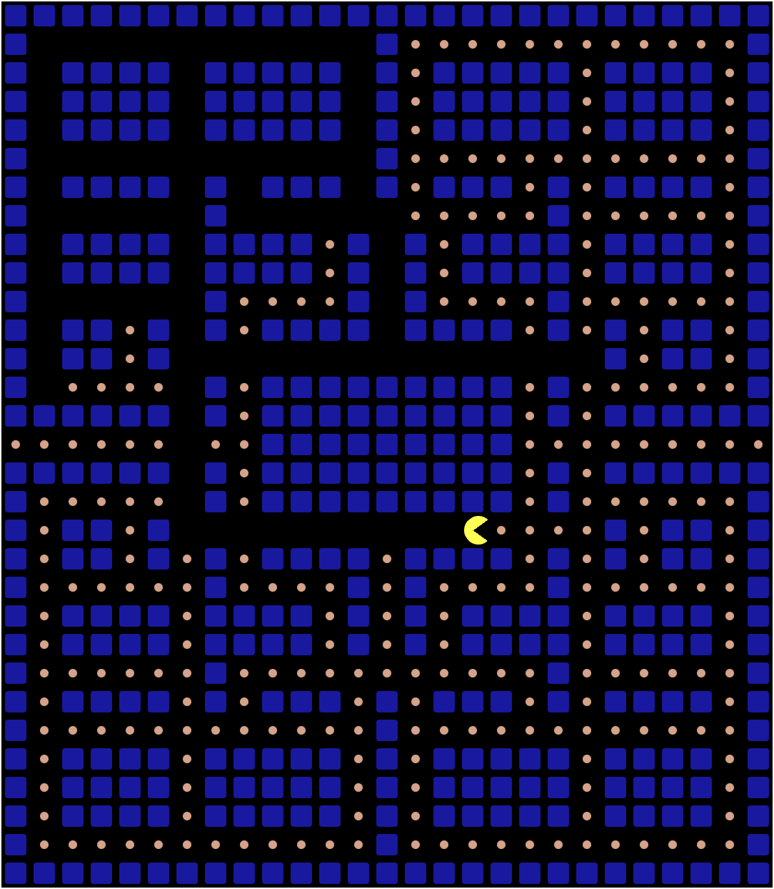

# Pacman game

WIP

## Getting started

* `make deps` - Install build dependencies
* `make watch` - Start [Browsersync](https://browsersync.io/) and serve app, makes use of [entr](https://formulae.brew.sh/formula-linux/entr)
* `make help` - See more options

